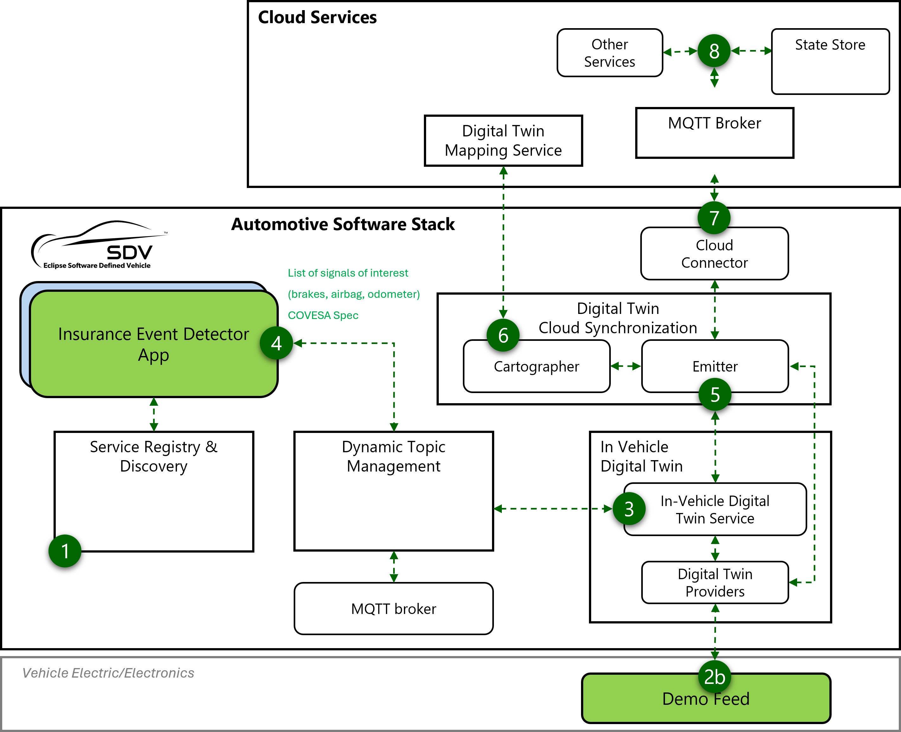

<!--
SPDX-FileCopyrightText: 2023 Contributors to the Eclipse Foundation

See the NOTICE file(s) distributed with this work for additional
information regarding copyright ownership.

Licensed under the Apache License, Version 2.0 (the "License");
you may not use this file except in compliance with the License.
You may obtain a copy of the License at

     http://www.apache.org/licenses/LICENSE-2.0

Unless required by applicable law or agreed to in writing, software
distributed under the License is distributed on an "AS IS" BASIS,
WITHOUT WARRANTIES OR CONDITIONS OF ANY KIND, either express or implied.
See the License for the specific language governing permissions and
limitations under the License.

SPDX-License-Identifier: Apache-2.0
-->
# Edge components

This code implements risk event detectors that categorize driving style.

# Risk Events Detector

Each Risk event detector monitors vehicle signals everytime that they change, at a given refresh rate. The algorithm of each event detector varies - in some cases it requires analyzing previous data, or it can be a simple ramp up or ramp down threshold detection.

Once an event is trigger, the event detector will capture additional signals before and after the event.

The following is a list of potential detectors.

| Event             | Monitored Signals             |   Additional Captured Signals    |
|-------------------|-------------------------------|-----------------------|
| Speeding          | Speed, Speed Limit            | Position, Wheel Position Sensor, Accelerator Pedal Position, Brake Pedal Position |
| Reckless Driving  | Longitudinal Acceleration, Lateral Acceleration | Position, Brake Pedal Position, Obstacle detection |
| Rain              | Rain Intensity                | Position  |
| Unsafe Lane Changes | Wheel Position Sensor, Speed, Turn Indication, Lane Departure Warning | Position, Speed, Wheel Position Sensor, Turn Indication |
| Tailgaiting       | Speed, Obstacle Position      | Accelerator Pedal Position, Brake Pedal Position, Longitudinal and Lateral Acceleration, Wheel Position Sensor |